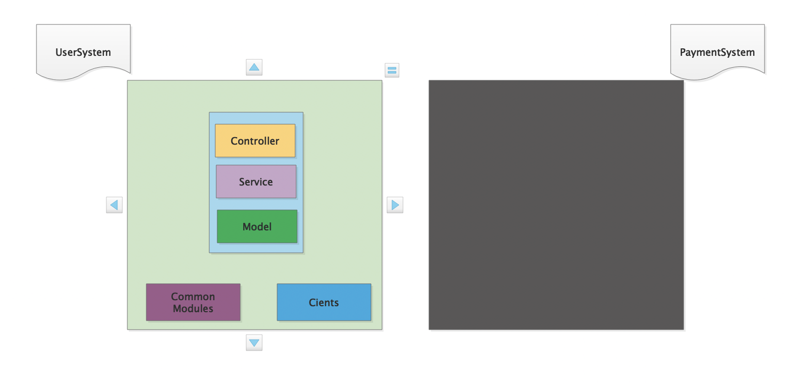

# spring test demo project
示例项目用于演示测试/TDD，使用mockito/spring/spring boot test包含一些常见的测试用例写法、示例程序
## 使用到的技术组件/框架
 - 基础组件/框架:java 11  springboot springmvc jpa lombok mapstruct mariaDB4j
 - 构建工具: java11 gradle

## 各个包名功能描述(src/main/java)
- client: 三方系统，包含一个 ```PaymentClient``` 用于指代支付系统
- common: 系统中一些公共的代码
- config: spring boot配置/bean 配置
- controller: 基于springmvc,包含三个api 用于示例演示
    - ```GET  /user/info/{userId}``` 根据userId获取指定用户信息
    - ```POST /user``` 创建用户
    - ```GET  /user/query-by-username``` 根据用户名获取指定用户信息
- dto: DTO对象,用于各个系统/模块之间的数据交互对象
- entity: jdbc持久化的数据对象
- service: 业务逻辑层,包含一个```UserService```示例
- repository: JPA数据持久化层
- ms: mapstruct mapper 对象,用于entity/dto之间对象转换

## 各个包名功能描述(src/test/java)
- benchmark: 包含多线程/多进程层面的接口测试
- config: 测试类所需要的配置bean
- integrationtest: 集成测试示例代码
- testdouble: 测试替身的示例代码
- unittest: 单元测试示例代码
- util: 工具类
- IntegrationTestBase: 集成测试的基类
- TruncateDatabaseService: 测试过程中数据清理的工具类


## 一张简单的系统架构图


